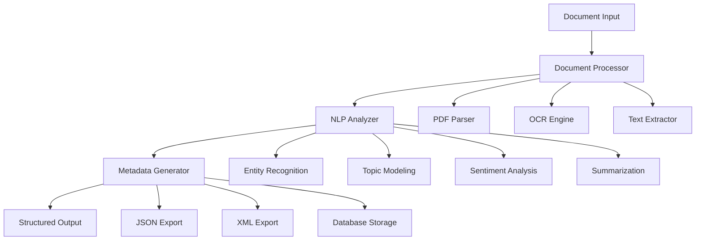

# 🤖 Intelligent Document Metadata Extraction System

<div align="center">


**An AI-powered document intelligence platform that transforms unstructured documents into actionable metadata using advanced NLP and machine learning techniques.**

</div>

---

## 🎯 **Project Vision**

In today's data-driven world, organizations struggle with vast amounts of unstructured document data. Our **Intelligent Document Metadata Extraction System** addresses this challenge by automatically transforming documents into structured, searchable metadata using cutting-edge AI techniques.

### **The Problem We Solve**
- **Information Overload**: Manual document processing is time-consuming and error-prone
- **Knowledge Silos**: Important information locked in unstructured formats
- **Compliance Challenges**: Difficulty in document classification and content analysis
- **Search Inefficiency**: Poor discoverability of relevant documents

### **Our Solution**
A comprehensive AI-powered system that intelligently processes, analyzes, and extracts meaningful metadata from diverse document types, enabling organizations to unlock the value of their document repositories.

---

## 🏗️ **System Architecture & Approach**

### **Multi-Modal Processing Pipeline**

Our system employs a sophisticated three-stage architecture designed for scalability and accuracy:



### **1. 📄 Document Processing Layer**
- **Multi-format Support**: Native handling of PDF, DOCX, TXT, and image-based documents
- **Advanced OCR**: Tesseract-powered optical character recognition for scanned documents
- **Content Preservation**: Maintains document structure and formatting context
- **Error Handling**: Robust exception handling for corrupted or unusual file formats

### **2. 🧠 Natural Language Processing Engine**
- **Named Entity Recognition**: Identifies people, organizations, locations, and custom entities
- **Topic Modeling**: Unsupervised discovery of thematic content using LDA and advanced clustering
- **Sentiment Analysis**: Multi-dimensional sentiment scoring (positive, negative, neutral)
- **Automatic Summarization**: Extractive and abstractive summarization techniques
- **Keyword Extraction**: TF-IDF and contextual keyword identification
- **Language Detection**: Automatic language identification and processing

### **3. 🔧 Metadata Generation Framework**
- **Structured Output**: Standardized metadata schemas (JSON-LD, Dublin Core compatible)
- **Confidence Scoring**: Machine learning-based confidence metrics for each extracted feature
- **Custom Taxonomies**: Support for domain-specific classification schemes
- **Temporal Analysis**: Document aging and relevance scoring


---

## 🛠️ **Technical Stack & Implementation**

### **Core Technologies**
- **Backend**: Python 3.8+ with async/await support
- **NLP Framework**: spaCy, NLTK, Transformers (HuggingFace)
- **ML Libraries**: scikit-learn, TensorFlow/PyTorch for custom models
- **Document Processing**: PyMuPDF, python-docx, pytesseract
- **Web Framework**: Streamlit for rapid prototyping
  
---

## 📋 **Installation & Setup**

### **Prerequisites**
- Python 3.8 or higher
- 4GB+ RAM (8GB recommended for large document processing)
- Tesseract OCR engine
- Git

### **Quick Start**

```bash
# Clone the repository
git clone https://github.com/t0bleronee/metadata_extraction.git
cd metadata_extraction

# Create virtual environment
python -m venv venv
source venv/bin/activate  # Linux/Mac
# or
.\venv\Scripts\activate   # Windows

# Install dependencies
pip install -r requirements.txt

# Download required NLP models
python -m spacy download en_core_web_sm
python -m spacy download en_core_web_lg  # Optional: Better accuracy

# Run the application
streamlit run app.py
```


### **Advanced Configuration**

Create a `config.yaml` file for customization:

```yaml
processing:
  batch_size: 10
  max_file_size: 50MB
  supported_formats: [pdf, docx, txt, png, jpg]
  
nlp:
  language: en
  confidence_threshold: 0.7
  max_keywords: 20
  enable_entity_linking: true
  
export:
  default_format: json
  include_raw_text: false
  compression: gzip
```

---

## 💡 **Usage Examples**

### **Basic Usage**

```python
from metadata_extractor import MetadataExtractor

# Initialize the system
extractor = MetadataExtractor()

# Process a single document
metadata = extractor.process_document("path/to/document.pdf")
print(f"Extracted {len(metadata.keywords)} keywords")
print(f"Document sentiment: {metadata.sentiment}")

# Batch processing
results = extractor.process_directory("./documents/")
extractor.generate_report(results, "analysis_report.html")
```

### **Advanced Features**

```python
# Custom entity extraction
custom_entities = ["Product Names", "Project Codes", "Department Names"]
extractor.add_custom_entities(custom_entities)

# Domain-specific processing
extractor.set_domain("legal")  # Optimizes for legal documents

```

### **API Usage**

```python
import requests

# REST API endpoint
response = requests.post(
    "http://localhost:8501/api/extract",
    files={"document": open("document.pdf", "rb")},
    data={"include_summary": True, "language": "en"}
)

metadata = response.json()
```

---


## 🎨 **User Interface & Experience**

### **Web Interface Features**
- **Drag & Drop Upload**: Intuitive file upload with progress tracking
- **Real-time Processing**: Live updates during document analysis
- **Interactive Visualizations**: Word clouds, topic distributions, sentiment trends
- **Export Options**: Multiple format support (JSON, CSV, XML, PDF report)
- **Responsive Design**: Works seamlessly on desktop and mobile devices

### **Command Line Interface**
```bash
# Process single file
python cli.py process --file document.pdf --output metadata.json

# Batch processing
python cli.py batch --input ./docs --output ./results --format csv

# Generate analytics report
python cli.py analyze --input ./results --report dashboard.html
```

### **Jupyter Notebook Integration**
- **Interactive Analysis**: Step-by-step document processing
- **Visualization Widgets**: Interactive charts and graphs
- **Experimentation**: Easy testing of different parameters
- **Educational**: Perfect for learning and demonstration

---

## 🔧 **Configuration & Customization**

### **Custom Processing Pipelines**

```python
class CustomProcessor(DocumentProcessor):
    def __init__(self):
        super().__init__()
        self.add_preprocessor(self.domain_specific_cleaner)
        self.add_postprocessor(self.quality_enhancer)
    
    def domain_specific_cleaner(self, text):
        # Custom cleaning logic
        return cleaned_text
```

### **Plugin Architecture**

```python
# Custom metadata extractors
@register_extractor("financial_metrics")
def extract_financial_data(text):
    # Extract financial figures, ratios, etc.
    return financial_metadata

# Custom export formats
@register_exporter("confluence")
def export_to_confluence(metadata):
    # Format metadata for Confluence import
    return confluence_markup
```

---


### **Development Setup**
```bash
# Fork and clone the repository
git clone https://github.com/yourusername/metadata_extraction.git

# Install development dependencies
pip install -r requirements.txt

# Install pre-commit hooks
pre-commit install

# Run tests before committing
pytest
```


---
